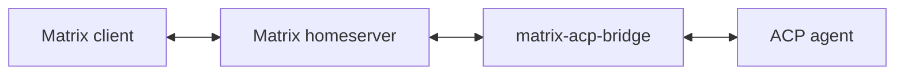

# matrix-acp-bridge

Use `matrix-acp-bridge` to talk to your agents from
[Matrix](https://matrix.org/). It relays Matrix messages to and from
[Agent Client Protocol (ACP)](https://agentclientprotocol.com/) agents.



## Features

1. plaintext messages
2. typing indicators
3. read receipts
4. catch-up across bridge restarts
5. SAS verification
6. encrypted messages
7. independent conversations in Matrix threads
8. mid-turn steering for agents that advertise support

## Installation and verification

```sh
node --version                 # Tested with v22 through v26
npm ci                         # installs exactly package-lock.json
npm run build                  # cleans and emits production files to dist/
npm run typecheck              # checks production and test sources without emitting
npm test                       # builds dist/ and dist-test/ before running tests
npm run format                 # fix spacing and format the repository
npm run check                  # formatting, lint, typecheck, and test gate
```

## ACP Connection

The bridge must have a full-duplex ACP stdio connection:

```text
ACP agent stdout  ───────▶ bridge stdin
ACP agent stdin   ◀─────── bridge stdout
```

`socat` can connect an ACP agent and the bridge through a Unix
socket:

```sh
socat UNIX-LISTEN:/run/matrix-acp-bridge/acp.sock,unlink-early,mode=0600 \
  EXEC:'/opt/acp-agent/bin/acp-agent'
```

Then connect the bridge:

```sh
socat UNIX-CONNECT:/run/matrix-acp-bridge/acp.sock \
  EXEC:'node /opt/matrix-acp-bridge/dist/main.js --config /etc/matrix-acp-bridge/config.toml'
```

## Configuration

Copy [`config.toml.example`](config.toml.example) to `config.toml` and update
its values.

```toml
state_dir = "/var/lib/matrix-acp-bridge"

[matrix]
homeserver = "https://matrix.example.org"
user_id = "@bridge:matrix.example.org"
device_id = "MABRIDGE01"
access_token_file = "/var/lib/matrix-acp-bridge/matrix-access-token"
allowed_rooms = ["!private-room:matrix.example.org"]
allowed_senders = ["@operator:matrix.example.org"]
response_mode = "room"    # or "thread"; defaults to room
default_message_delivery = "prompt" # or "steer"; defaults to prompt
encryption = "disabled"   # or "required"

[acp]
cwd = "/srv/acp-agent/workspace"

[limits]
max_input_bytes = 16384
max_output_bytes = 262144
max_matrix_message_bytes = 32768
max_activity_events_per_message = 10
max_queued_turns_per_conversation = 16
max_concurrent_prompts = 4
max_turn_seconds = 1800
shutdown_grace_seconds = 30
startup_timeout_seconds = 60
initial_sync_timeline_limit = 100
max_catchup_age_seconds = 900
max_catchup_events_per_room = 4
```

## Prompts and steering

Unprefixed messages use `matrix.default_message_delivery`, which defaults to
`"prompt"`. `/prompt <message>` and `/steer <message>` override that setting for
one message. The command and separating whitespace are stripped; the remaining
payload is preserved. Bare commands return usage guidance. Input size limits
include the original command body. Other slash commands are agent text and use
the configured default. Exact `/reset` remains an ordered bridge control;
`/prompt /reset` or `/steer /reset` sends `/reset` as agent text.

Prompts run in FIFO order within each conversation, with one unresolved prompt
at a time. Steering uses a separate serial lane targeting the running turn. For
example, while A is running, `/prompt B` waits for A and `/steer C` can reach A
before B starts. A queued `/reset` is a barrier: later input waits behind reset
and uses the replacement session. Steering never cancels or restarts A.

When idle, the first steering message automatically becomes a tracked prompt.
Later steering messages can target it after it starts, including when a batch
arrives during startup, session setup or a wait for a global prompt slot. The
bridge displays `No running turn; message queued as a prompt.` for the fallback.
Agents without steering support use prompt FIFO and display
`Steering unavailable; message queued as a prompt.` No user resend is needed.

Successful steering is silent. The agent acknowledges acceptance into Pi's
queue; this does not prove model consumption. Pi schedules steering after current
tool execution and before a subsequent model call, using its own queue policy.
The bridge does not set Pi's `/steering` queue mode or interrupt tools. Assistant
text, activity and typing remain part of the original turn. Healthy method
errors display `Steering failed; message was not resubmitted.` and leave that
turn running. A missing method disables steering until the next connection.
Ambiguous timeouts and protocol, transport or durable-state failures stop the
bridge without automatically resubmitting input.

`max_queued_turns_per_conversation` covers waiting prompts, resets and pending
steering, including an unresolved steering request. The active prompt is
excluded. `max_concurrent_prompts` bounds unresolved prompts globally; steering
uses no extra prompt slot. Steering requests use `startup_timeout_seconds` and
do not reset the running turn's `max_turn_seconds`. Accepted steering leaves
the bridge backlog, so these limits do not bound Pi's accepted queue. Thread
mode has a separate backlog per root and no aggregate room backlog cap.

In room mode, both commands target that room's session. In thread mode, every
top-level message starts its own conversation; top-level steering starts a
tracked prompt. Follow-ups target only their thread root, and notices and output
use that thread's validated encryption path. Use `/reset` inside a thread to
reset it; top-level `/reset` returns guidance.

Restart catch-up applies the same rules to selected messages, using current
session state. Completed injected event IDs are durably suppressed; converted
prompts remain incomplete until their normal terminal boundary. No steering
state migration is needed. A crash between ACP acceptance and durable completion
can replay input; acceptance does not ensure consumption before a crash. Pending
bridge work and Pi's queue are not promised recoverable. ACP cancellation is
session-scoped, so accepted steering cannot be cancelled independently from its
running turn. Exactly-once delivery is not guaranteed.

Pi steering currently requires the build from
[pi-acp PR #115](https://github.com/svkozak/pi-acp/pull/115), which remains open.
See [steering transport verification](docs/steering-acp-transport.md) for the
tested revision, commands and integration limits.

## Encryption Setup

Stop the daemon and then run:

```sh
node /opt/matrix-acp-bridge/dist/main.js \
  --config /etc/matrix-acp-bridge/config.toml crypto bootstrap

node /opt/matrix-acp-bridge/dist/main.js \
  --config /etc/matrix-acp-bridge/config.toml crypto verify --device TRUSTED_DEVICE_ID
```

`TRUSTED_DEVICE_ID` is the device ID of an already trusted Matrix client, such
as Element. Compare the emoji and decimal SAS values shown by both devices,
then type exactly `yes` in the bridge terminal to confirm them.

## AI

I co-authored the planning, specifications, and integration tests for
`matrix-acp-bridge` with GPT 5.6 Sol. GPT 5.6 Luna implemented it with `xhigh`
reasoning effort and can run the integration tests.

**Initial Prompt**

I want to build a matrix client to acp bridge. This will allow me to create a matrix room with a 'chadagent' user and my user 'chad' and I'll be able to send messages which the agent will respond to. We'll connect to the agent via acp using a stdio. I want the agent user to be a normal user. Hopefully no application service needed for synapse. Let's start by inspecting these two implementations ~/code/github.com/openclaw/openclaw/extensions/matrix and ~/code/github.com/zooid-ai/zooid. Start some notes in spec/spec.md. What's going to be involved? How practical is it? How simple can we keep it? What's needed for security? Can we support e2ee?
