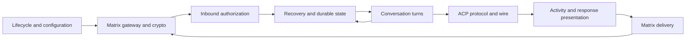
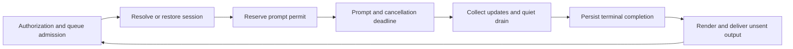
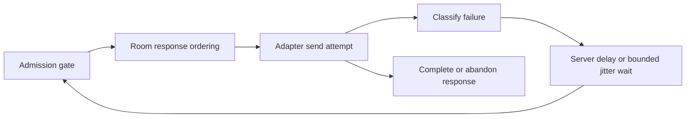
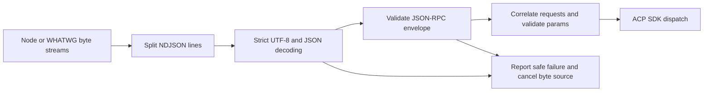

# Architecture and CODE.md assessment

Chad's Agent assessed the bridge against each recommendation in
`chad/agents/CODE.md`. The design below starts from the supported behavior,
then selects incremental changes that preserve the existing protocol, config,
and durable-state boundaries. Book references inform the principles; reading
those books is not a delivery dependency.

## Behavior and contracts

| Functionality                       | Actual contract and implementation                                                                                                                                                                                                                                                                                   | Automated evidence                                                                                                                                                |
| ----------------------------------- | -------------------------------------------------------------------------------------------------------------------------------------------------------------------------------------------------------------------------------------------------------------------------------------------------------------------- | ----------------------------------------------------------------------------------------------------------------------------------------------------------------- |
| Authorization and filtering         | `authorization.ts` gates exact room/sender IDs, rejects self, redacted, edited, unsupported and malformed events; validates encryption metadata and relations before session work. Normalized reply fallbacks preserve ordinary quotes.                                                                              | Authorization and bridge tests, including rejected thread roots and transport-plaintext rejection.                                                                |
| Sync and restart recovery           | `matrix-client.ts` uses normal SDK initial sync on every process start; SDK owns reconnect timing. `sync-coordinator.ts` establishes the first-run suppression baseline, bounds unseen restart admission by event timestamp, per-room count and queues, and persists terminal completion before delivery.            | Real SDK HTTP tests; sync, state and M2 integration tests exercise incomplete/completed IDs, outages and interrupted turns.                                       |
| Conversation identity               | Room mode is the default. Thread mode keys identity by room/root, uses ordered per-conversation queues and lazy session loading, suppresses load-history updates, and retains sessionless identities across reset. Unsupported loading discards prior mappings; stale method errors recover only their conversation. | Conversation, store, bridge and daemon composition tests cover concurrency, reset, mode switching, restart and state faults.                                      |
| ACP transport and turns             | One inherited full-duplex ACP v1 NDJSON connection; no child process ownership. Strict UTF-8/JSON/envelopes and request correlation fail closed. Permissions prefer `allow_always`, then `allow_once`, otherwise cancel. Prompt permits cover unresolved prompts only; cancellation is coalesced.                    | ACP client/wire and coordinator tests cover framing, permissions, loading, notices, malformed traffic, EOF and cancellation.                                      |
| Text and activity                   | Activity normalization, retained thought/tool models, batch presentation and Markdown packing are distinct. Text closes at message/activity boundaries; tools edit their original batch. Exact wire-payload measurement includes thread/edit envelopes. Final delivery excludes already-sent text.                   | Activity, response, Markdown, content, and bridge tests cover budgets, Unicode, late updates, truncation and send/edit order.                                     |
| Encryption and SAS                  | The SDK owns cryptography and ciphertext construction. Required mode accepts authenticated decrypted wire-encrypted events only and never sends plaintext fallback. Private manifests bind identity/fingerprints; restore precedes Rust initialization. Bootstrap/explicit SAS use `/dev/tty`, not ACP descriptors.  | Crypto, verification, IndexedDB and eleven M3 integration scenarios cover continuity, missing stores, SAS success/rejection/timeout, late decryption and cleanup. |
| Lifecycle, resources and operations | Strict TOML/CLI, private token files and process lock. Startup gates precede dispatch; partial startup and signal/fatal paths close owned resources and flush accepted state. Typing is room-aggregate, refreshed at 10 seconds with a 30-second timeout; receipts acknowledge eligible dispositions.                | Config, main and bridge tests cover gates, limits, typing, receipts, signals, timeout, failure injection and resource release.                                    |

Current state is schema 13: identity, initialized marker, room/thread mappings
and bounded completed IDs. There is no persisted sync cursor, transcript, prompt
or response outbox. Schema-12 migration remains unchanged. Some older milestone
sections still describe cursor/schema-11 behavior; the connection-recovery
specification, thread state operations and executable SDK tests describe the
current implementation. The abandoned cursor-store and MCP-server proposals
are historical, not features to implement in this refactor.

A durable terminal completion favors avoiding duplicate ACP work over ensuring
response delivery: a crash between completion persistence and Matrix acceptance
can lose a response. ACP v1 updates have no prompt ID; late id-less output cannot
be unambiguously attributed after a turn closes. These are compatibility limits,
not accidental guarantees to preserve by adding a second ledger or transport.

## Greenfield design

Eight coherent components suffice. Arrows show logical data flow; lifecycle
constructs the components and orders their acquisition/release.

| Component             | Responsibility, interface and state owner                                                                                                                                                               | Effects and lifecycle                                                                                                                                |
| --------------------- | ------------------------------------------------------------------------------------------------------------------------------------------------------------------------------------------------------- | ---------------------------------------------------------------------------------------------------------------------------------------------------- |
| Lifecycle/config      | Parse config/CLI; acquire lock; initialize adapters; open gates; consume fatal signals. `runDaemon` and crypto commands own the process operation.                                                      | Files/secrets, signals and resource acquisition. Release lock after state/crypto closure; retain startup/shutdown deadlines.                         |
| Matrix gateway/crypto | Normalize SDK batches/decryption, enforce identity/room invariants, submit prepared messages, typing/receipts and SAS. `MatrixClientAdapter` hides SDK objects; narrow bridge adapter handles delivery. | SDK/network and crypto instance ownership; initialize restored storage before sync and stop SDK before final snapshot flush.                         |
| Inbound policy        | Return accepted, oversized or rejected data from normalized event metadata and config. Session identity never grants access.                                                                            | No transport or persistence; optional bounded metadata diagnostics.                                                                                  |
| Recovery/state        | Suppress completed IDs, select catch-up, atomically persist terminal completions and conversation records. `BridgeStateStore` exposes snapshots and named mutations.                                    | Serialized private writes with file fsync/rename/directory fsync. Lifecycle holds its lock and flushes it.                                           |
| Conversation turns    | Admit/order work, resolve session, reserve prompt slot, collect/drain updates, aggregate typing and request cancellation.                                                                               | Coordinator owns active runs, queues, timers, subscriptions and outbound operation accounting; no SDK calls except adapter methods.                  |
| ACP protocol/wire     | Negotiate ACP, correlate RPC, normalize updates/permissions; wire owns framing and reader/writer locks. Existing `AcpClient` remains the replaceable transport boundary.                                | Inherited input is cancelled on terminal framing failure; inherited output descriptor belongs to the runner and is never closed by framing.          |
| Presentation          | Transform update/response records into bounded text/HTML and payload descriptors. Retained per-turn activity has local mutations; rendered output is readonly.                                          | No network, filesystem or delivery IDs. Exact size measurement is injected where routing changes wire size.                                          |
| Delivery              | Serialize full responses and live edits per room; classify failure and wait/retry stable payloads. `MatrixDelivery.sendParts/sendLive` return delivery outcome.                                         | Own room promise tails and retry timers; drop finished tails. Coordinator stops admission through `canSend` and cancels retry waits during shutdown. |

### Zoom: conversation turns

A conversation owns its queue and session reference. Room state only groups
conversations and typing activity. Permit release precedes quiet drain; session
creation/loading and Matrix output never consume a permit. Durable reset precedes
in-memory reset and acknowledgement. Output completion precedes the next turn
in that conversation; other conversations progress independently.

### Zoom: delivery and wire

The actual retry loop retains its room serialization slot, so another response
cannot interleave multipart output. A permanent error skips remaining parts;
independent rooms can proceed. Shutdown blocks each future attempt, lets an
already-started request settle and cancels timer waits. One explicit internal
best-effort session-creation error path may send during fatal handling with
retries disabled, preserving its existing contract.

Frame parsing cannot access rooms, session persistence or presentation.
Decoding/envelope validation returns data or a safe typed failure before the
stream wrapper reports failure or enqueues a frame. Observer
correlation remains in the ACP client. Wire cleanup releases its reader lock
without waiting for an underlying source's cancellation promise to settle.

### Security and persistence boundaries

Only the gateway holds Matrix credentials and SDK crypto objects. Neither
presentation nor delivery receives tokens, cipher keys, SAS data or raw SDK
objects. Policy runs before session work and durable admission. Diagnostics
contain fixed classifications and allowed metadata, never raw error bodies or
headers. A normalized adapter classification is authoritative; raw-error
fallbacks cannot turn a permanent HTTP/authentication failure into a retry based
on message text.

The state lock excludes concurrent daemon/bootstrap/verification operations.
Bridge state records metadata only; the separate private SDK snapshot contains
opaque crypto secrets. The OS/container restrictions of the ACP agent remain
its execution boundary: allowed Matrix senders can prompt an automatically
permission-granting agent. No new room membership, listener or credential path
is introduced.

## Incremental implementation and compatibility

The existing policy, persistence, crypto and presentation modules already match
these responsibilities. Retain their tested interfaces and durable formats.
Extract only functionality whose ownership was mixed inside coordinators:

1. `acp-wire.ts` owns strict framing and byte-stream conversion, leaving RPC
   operations and request correlation in `acp-client.ts`. Its previous public
   type import paths remain re-exported by the client.
2. `prompt-permits.ts` owns FIFO capacity and idempotent release; remove unused
   semaphore inspection APIs, unnecessary waiter mutation and repeated release
   closures.
3. `matrix-delivery.ts` owns room serialization and retry effects.
   `matrix-retry.ts` separates classification/jitter calculations and shares
   server-hint parsing with the SDK adapter. `clock.ts` shares bounded timer
   conversion. Coordinator retains output byte checks and lifecycle accounting.
4. Lint all source/tests through the existing test TypeScript project instead
   of one default-project compilation per test and an arbitrary 32-file cap.
   Compatible lockfile updates fix brace-expansion and js-yaml audit findings;
   direct runtime dependency versions remain pinned.

There is no config, transaction-ID, response text, authorization, encryption,
SAS or state migration change. Explicit behavior corrections are:

- Fatal malformed ACP framing cancels the byte source as well as releasing the
  reader lock; an errored wrapper stream cannot delegate later cancellation.
- Response delivery checks the stop gate before every part/queued response,
  preventing sends that used to start after shutdown.
- Shutdown immediately cancels response backoff instead of needlessly waiting
  for the grace deadline when no request is active.
- Permanent raw HTTP/authentication failures beat network wording or retry flags.
- HTTP-date Retry-After uses the injected delivery clock; both SDK and delivery
  recognize safe top-level/data/getter/header timing hints. Invalid negative
  hints fall through rather than scheduling an immediate retry.

## Individual guidance assessment

Each row corresponds to one recommendation, including nested recommendations.
Evidence refers to the resulting implementation; retained code is justified
where a further abstraction would cost more than it clarifies.

| Criterion                                               | Evidence, remedy or reason to retain                                                                                                                                                                           |
| ------------------------------------------------------- | -------------------------------------------------------------------------------------------------------------------------------------------------------------------------------------------------------------- |
| Design: 5–10 directional components                     | Eight components and data flow above; delivery and wire extraction make ownership visible in code.                                                                                                             |
| Design: self-similar zoom                               | Conversation, delivery and wire diagrams expose comparable small decompositions with explicit hand-offs.                                                                                                       |
| Design: avoid spaghetti                                 | Adapter effects do not enter policy/rendering; retry timers and framing are no longer coordinator internals.                                                                                                   |
| Design: composable interchangeable behavior             | Existing clock, transport, store and adapter contracts support real/fake implementations; optional room/thread behavior is data-driven.                                                                        |
| Design: prefer immutable data                           | Readonly event/outcome/payload records; shared pure retry calculations. Keep local mutable queues/activity where ordered asynchronous transitions require them.                                                |
| Design: remove dead code                                | Remove identity-only safe-error wrapper, unused semaphore getters, cancelled waiter flags and obsolete retry/header helpers.                                                                                   |
| Design: repair defects while working                    | Framing cleanup, permanent retry priority, stopped sends and shutdown backoff have regression tests.                                                                                                           |
| Design: group by functionality                          | Framing, prompt scheduling and outbound delivery own behavior and associated contracts; no generic types registry added.                                                                                       |
| Design: avoid data-only catch-all files                 | Existing crypto-contracts is a narrowly shared crypto boundary, not a catch-all; all new contracts live with their functionality.                                                                              |
| Abstractions: consider data/object anti-symmetry        | Failure classifications/rendered messages are data for extensible calculations; adapters are behavior for replaceable implementations.                                                                         |
| Abstractions: data structures for more functions        | Retry policies operate on existing failure records without class hierarchies.                                                                                                                                  |
| Abstractions: class interfaces for more implementations | Keep existing ACP/Matrix/clock/store interfaces for production and fault-injection implementations. No delivery interface with only one implementation.                                                        |
| Abstractions: minimize cross-component knowledge        | Delivery receives adapter, gate, clock and diagnostics; it knows no queues, sessions, manifest or coordinator fields.                                                                                          |
| Abstractions: prevent leaking internals                 | Room tails and retry waits are private; wire exposes streams/safe notices, not reader handles.                                                                                                                 |
| Abstractions: balance abstraction count                 | Four functional extractions, no generic executor, middleware, registry or inheritance framework.                                                                                                               |
| Scope: minimal scope                                    | Private delivery scheduling/waits, private wire error and parsing; declarations exported only when another module needs them.                                                                                  |
| Scope: smallest variable/method scope                   | Attempt counters belong to a send loop; timer resolution belongs to its wait; permit release state belongs to its closure.                                                                                     |
| Scope: single-function constants                        | Timer maximum is local to shared conversion; retry caps are local to their calculation. Named shared protocol limits remain near their consumers.                                                              |
| Scope: expose only needed APIs                          | Prompt permits expose acquire/cancel only; retain existing public client re-exports for compatibility.                                                                                                         |
| Naming: descriptive names                               | MatrixDelivery, PromptPermits, readMatrixRetryAfterMs and clampTimerMilliseconds describe actual responsibilities.                                                                                             |
| Naming: functions start with verbs                      | New behavioral methods use create, convert, read, classify, calculate, clamp, send, cancel, acquire or release. Existing public nouns are preserved where renaming would be an unrelated compatibility change. |
| Naming: consistent concepts                             | Conversation for queue/session identity; room for outbound/typing scope; retry delay always milliseconds.                                                                                                      |
| Naming: use established terminology                     | JSON-RPC, NDJSON, prompt permits, Matrix parts/edits and Retry-After; no invented routing framework.                                                                                                           |
| Naming: name meaningful constants                       | Named retry caps and one shared Node timer bound; exact protocol literals remain identifiable at their boundary.                                                                                               |
| Responsibilities: clear contracts and hand-off          | Policy → authorized event; recovery → durable completion callback; coordinator → immutable payload; delivery → adapter result.                                                                                 |
| Responsibilities: early preconditions                   | Permit capacity validation; stream/envelope validation before dispatch; send gate before admission and attempts.                                                                                               |
| Responsibilities: one responsibility per function       | Retry calculations separate from sending/timer waits; room ordering and framing conversion are focused helpers. Existing turn/lifecycle orchestration necessarily calls several domain steps.                  |
| Responsibilities: effectful operations focus on effects | Delivery owns network/timer effects, wire owns byte I/O, stores own atomic writes; calculations return data and do not perform sends.                                                                          |
| Comments: prefer readable code                          | Sparse comments explain descriptor ownership and cancellation invariants; named methods replace incidental bookkeeping.                                                                                        |
| Comments: no work logs in source                        | This document records stable design/review evidence. Chronological progress and failed-check logs stay in WAAP state or temporary files.                                                                       |
| Dependencies: own the entire stack                      | Real pinned SDK integration tests validate request semantics; lockfile audit fixes remove both reported vulnerabilities.                                                                                       |
| Dependencies: maintenance commitment                    | No dependency added; keep ACP/Matrix/Markdown/IndexedDB versions fixed and validate transitive patches with the full check.                                                                                    |
| Dependencies: prefer open source                        | Existing stack is open source; retain SDK crypto rather than creating proprietary/bridge cryptography.                                                                                                         |
| Errors: actionable user errors                          | Existing config/state errors provide recovery steps; user-facing busy/oversized/unknown-thread texts remain stable. ACP/Matrix failure replies deliberately remain content-free.                               |
| Errors: diagnostic internal errors                      | Preserve safe operation, classification and part metadata; tests assert raw write-error content is absent. More raw detail would violate the existing secret boundary.                                         |
| Feel: vague names                                       | New functions/components describe domain behavior; remove the misleading no-op safeErrorMessage helper.                                                                                                        |
| Feel: repeated code                                     | Share Retry-After and timer normalization; one permit release closure factory; room serialization serves both live/final sends.                                                                                |
| Feel: long functions                                    | Extract wire (~250 lines) and delivery/scheduling (~350 lines) from coordinators. Retain orchestration where splitting would only expose tightly coupled turn state.                                           |
| Feel: too many class methods                            | Delivery and permits have small public surfaces. Larger existing Matrix/lifecycle classes retain SDK-specific private handling; no new public methods added to them.                                           |
| Feel: too many record fields                            | Remove outbound mutex from room state and mutable cancelled flag from permit waiters. Keep turn collector fields needed for streaming/drain attribution rather than a bag of optionals crossing modules.       |
| Feel: long parameter lists                              | Delivery takes one cohesive options record; framing has four transport-related inputs; no generic context containing unrelated services.                                                                       |
| Feel: unnecessary globals                               | Room/timer registries are instance-owned; maximum timer duration is function-local. Process-wide IndexedDB remains an explicit upstream Node compatibility boundary.                                           |
| Feel: excessive mutation                                | Immutable policy results and payloads; promise tails replace mutable mutex release bookkeeping; waiters are resolve functions, not mutable records.                                                            |
| Feel: isolated changes touch everything                 | Retry/framing/scheduling tests and implementation can now change locally; config/state/authorization need no changes for these extractions.                                                                    |
| Feel: speculative abstractions                          | No new transport, retention policy, outbox, dependency injection framework or generalized semaphore library.                                                                                                   |
| Feel: inconsistent objects                              | Discriminated outcomes and optional metadata remain strict under exactOptionalPropertyTypes; sessionless thread identities remain explicit.                                                                    |
| Feel: missing cleanup                                   | Cancel byte sources on terminal failure, release stream locks, delete finished room tails and cancel retry timers at stop. Existing reverse cleanup and state flush remain covered.                            |
| Testing: all code tested                                | New module contract tests plus existing coordinator/SDK/crypto integration tests; corrections have explicit regressions. Live limitations are disclosed below.                                                 |
| Testing: test pyramid                                   | Predominantly deterministic unit tests, hermetic cross-component/SDK tests, and separate user-perspective live Matrix harnesses. Harness unit tests are not live E2E evidence.                                 |

## Verification and remaining limits

Baseline: `npm ci` and `npm run check` passed 399 tests. Characterization after
extraction passed 412 tests before the failure-path corrections. New framing
cleanup, stopped-send and shutdown-backoff regressions fail against their
previous behavior. Final `npm run check` passed 420 tests on Node 26.10.0, including formatting,
lint, typecheck, production build and the hermetic/harness test suites.
Node 22 verification is configured in GitHub CI and was not run locally.
`npm audit fix --ignore-scripts` applied compatible development-only patches and
reported zero vulnerabilities; frozen reinstall and final checks verify the
committed lockfile.

All eleven documented room/thread plaintext/encrypted entry points were
attempted: normal exchange/restart, reset, restart persistence, completed-ID
recovery, room activity and both thread exchange/activity suites. Each exited
2 with `E2E_HOMESERVER is required`, before provisioning or sending any Matrix
traffic. Test account, room and ACP endpoint configuration was unavailable;
no live homeserver, SAS or deployment-client success is claimed. The README
now links the actual supported recovery command rather than a missing npm script.

Deliberately retained limits: best-effort crash delivery, id-less late ACP
output attribution, indefinite conversation/history retention and no aggregate
thread/setup limit. ACP framing still has no total-frame byte cap; the existing
activity budget caps normalized retained notification data, not wire frames.
Crypto snapshots still depend on fake-indexeddb internals and V8 serialization
and may lose changes newer than the last completed snapshot. Introducing new
limits or replacing that storage backend requires a separate compatibility and
migration decision. Larger Matrix/daemon/turn state machines remain coupled to
SDK lifecycle and tested turn ordering; further splitting them merely to reduce
file size is deferred. Live validation and Chad's review remain required before
merge; this refactor is submitted without merging.
